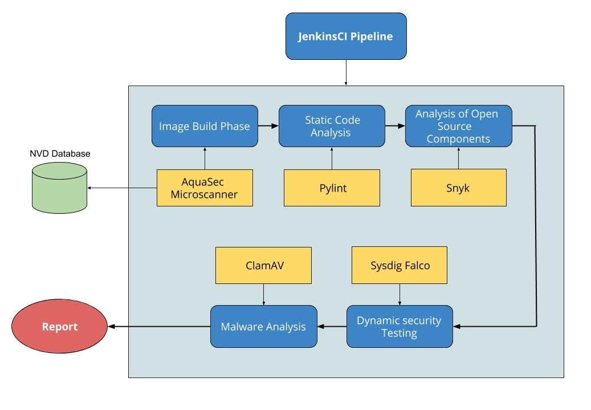

# Container Security With JenkinsCI

Securing the development lifecycle of containerised applications is essential for any product/company.   
This project automates the workflow for securing any containerised application in its development lifecycle.   

## Introduction

Containers have multiple open source components in them, and this could be a potential security threat.
Improper privilege configuration, and improper mounting of volumes, etc. create security loopholes that could be exploited through malware attacks like Cross Site Scripting (XSS), SQL Injection, etc.   
Hence it becomes important to secure the application at every stage as follows:   

1. Analyse vulnerabilities in open source components over the various phases of the container lifecycle.
2. Threat Diagnosis in Image Build and Container running Phase
3. Static Code Analysis
4. Source Component Analysis ( Analyis of Open Source Components in code)
5. Dynamic Application Security Testing
6. Malware Scanning  by introducing vulnerability in running container

## Approach

JenkinsCI was used for constructing and  automating  the workflow described above.
Each phase was constructed as a freestyle job. The jobs were then inserted as different stages of a main pipeline which orchestrated the flow.
The project is hosted on an AWS  EC2 instance for ease of Setup,  Volume portability and Remote Working amongst our team.

## Tools Used and Workflow Implementation

Groovy Script was used to integrate jobs and build the pipeline

Additionally, we also explored WhiteSource as an alternative to SNYK for Source Component Analysis

## Results

Real Time reports of Vulnerability details, Potential Fixes, Scores, and other summaries were generated at every stage. The builds failed when high severity vulnerabilities were detected. 